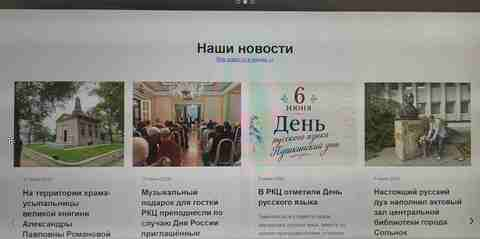

# Day 17 — Building Publication Repositories, the News and Media Overview, and the Events Calendar

**Date:** 2026-08-02  
**Status:** Completed  
**Day Rating:** 5/5

---

# What Was Done — In Plain Language

Day 17 transformed the limited homepage feeds into a complete publication storage, navigation, and search system.

News and announcements were already loaded from `home_feed_items`, but visitors mainly interacted with a few carousel cards. Older records remained in the database, while no convenient public interface existed for browsing the full publication history.

The project received:

```text
a shared News and Media overview
        ↓
a complete news repository
        ↓
a combined announcements and international-events repository
        ↓
search, filtering, pagination, and a calendar
```

The homepage received two links:

```text
All News and Media →
All Announcements and Events →
```

Pretty routes were configured:

```text
/new-home/ru/media/
/new-home/ru/news/
/new-home/ru/events/
```

A two-month calendar was developed for announcements and international events. It supports range selection, quick periods, apply and reset actions, and synchronization with the existing MySQL filtering.

---

# Main Objectives

1. Design the archive architecture.
2. Preserve three logical content types while launching two public repositories.
3. Create a universal configuration.
4. Implement safe SQL search, filtering, sorting, and pagination.
5. Create a shared card template.
6. Assemble `repository.php`.
7. Connect MySQL and fix the connection error.
8. Create `media.php`.
9. Add a right-side navigator.
10. Configure pretty URLs.
11. Build the interactive calendar.
12. Connect it to `date_from` and `date_to`.
13. Make the calendar compact.
14. Connect both user journeys to the homepage.

---

# Initial State

At the beginning of Day 17:

- `home_feed_items` contained news and four announcements;
- the homepage displayed two dynamic carousels;
- publications opened through a shared template;
- older records remained in the database;
- no public full catalog existed;
- search and pagination were missing;
- the News and Media overview did not exist;
- no events-calendar interface existed.

---

# 1. Repository Architecture

Three editorial types were preserved:

```text
news
event
international
```

Two public collections were enabled:

```text
news
→ content_type = news

events
→ content_type IN ('event', 'international')
```

The standalone `international` collection is already described in configuration but remains disabled.

## Showcase and Full Catalog

The homepage remains a showcase:

```text
LIMIT
→ several current cards
```

The repository displays the complete stream:

```text
all published records
→ search
→ filters
→ pagination
```

A record that leaves the carousel remains available in the repository.

---

# 2. `repository-config.php`

Created:

```text
/docs/new-home/includes/repository-config.php
```

It stores the project path, page size, locales, collections, date rules, sort modes, and type-filter settings.

---

# 3. `repository-query.php`

Created:

```text
/docs/new-home/includes/repository-query.php
```

It handles collection and locale validation, search, content-type filters, date ranges, counting, pagination, sorting, and current-page retrieval.

Events use:

```sql
COALESCE(event_start, publication_date)
```

Search covers `title`, `subtitle`, `tags`, and `event_location`.

Pagination uses `COUNT(*)`, `LIMIT`, and `OFFSET`.

---

# 4. Shared Card Template

Created:

```text
/docs/new-home/includes/repository-card.php
```

One template supports news, RCC announcements, and international events. It displays the image, type label, date or range, title, location, summary, and detailed-page link.

---

# 5. `repository.css`

All styles use the isolated `repository-` prefix.

Grid behavior:

```text
desktop → 3 cards
tablet  → 2 cards
mobile  → 1 card
```

The file also styles search, filters, empty states, errors, pagination, the overview page, the sticky navigator, and the events calendar.

---

# 6. `repository.php`

The page connects:

```text
repository-config.php
→ MySQL
→ repository-query.php
→ repository-card.php
→ repository.css
```

Supported parameters:

```text
collection
locale
q
type
date_from
date_to
page
```

The first launch exposed an incorrect MySQL host. Because the interface rendered correctly, the failure was isolated to the database connection. After reusing the working `new mysqli(...)` configuration, the page loaded eight news records.


---

# 7. Homepage Link

The homepage received:

```text
All News and Media →
```

It opens the shared overview rather than only the news archive.



---

# 8. `media.php`

Created:

```text
/docs/new-home/media.php
```

It acts as a navigation hub:

```text
News and Media
├── News
├── RCC Announcements
└── International Events
```

Links:

```text
News
→ /new-home/ru/news/

RCC Announcements
→ /new-home/ru/events/?type=event

International Events
→ /new-home/ru/events/?type=international
```


---

# 9. Right-Side Navigator

The overview includes:

```text
On This Page

News
RCC Announcements
International Events
```

Anchors:

```text
#media-news
#media-event
#media-international
```

Desktop uses a sticky right column; narrow screens move the navigator above the content.


---

# 10. Pretty URLs

Routes were added for:

```apache
RewriteRule ^(ru|hu)/media/?$ \
    media.php?locale=$1 [L,QSA,NC]

RewriteRule ^(ru|hu)/news/?$ \
    repository.php?collection=news&locale=$1 [L,QSA,NC]

RewriteRule ^(ru|hu)/events/?$ \
    repository.php?collection=events&locale=$1 [L,QSA,NC]

RewriteRule ^(ru|hu)/news/([a-z0-9-]+)/?$ \
    news.php?locale=$1&slug=$2 [L,QSA,NC]
```

The repository rule is placed before the detailed-publication rule, allowing Apache to distinguish the list from a slug page.

Technical URLs remain compatible, while public navigation uses the clean routes.

---

# 11. Events Calendar

The calendar is rendered only for:

```text
collection = events
```

It contains two months, navigation arrows, range selection, quick periods, Apply, and Reset.

Quick periods:

```text
Today
Tomorrow
Next Week
Next Month
```

---

# 12. `repository-calendar.js`

Created:

```text
/docs/new-home/js/repository-calendar.js
```

The script builds two months, renders weekdays and 42 cells, marks today, selects a start and end date, highlights the range, changes months, synchronizes `date_from` and `date_to`, and restores the selected state from the URL.

```javascript
function handleDateSelection(clickedDate) {
    if (!selectedStart || selectedEnd) {
        selectedStart = clickedDate;
        selectedEnd = null;
    } else if (
        compareDates(clickedDate, selectedStart) < 0
    ) {
        selectedStart = clickedDate;
        selectedEnd = null;
    } else {
        selectedEnd = clickedDate;
    }

    renderCalendar();
}
```

The JavaScript does not query MySQL directly:

```text
calendar
→ GET fields
→ repository-query.php
→ prepared SQL
→ filtered cards
```

---

# 13. Progressive Enhancement

Native date fields remain in the HTML.

After successful initialization, the form receives:

```text
has-enhanced-calendar
```

Only then does CSS hide the duplicate native row.

```text
JavaScript works
→ show enhanced calendar

JavaScript fails
→ native date controls remain available
```

---

# 14. Compact Final Layout

The first working calendar was too tall. The final design reduces spacing, cell height, headings, arrows, and right-column width. Quick periods, Apply, and Reset are grouped in the right column.


---

# 15. Final User Navigation

```text
Homepage
│
├── All News and Media
│   └── /ru/media/
│       ├── /ru/news/
│       ├── /ru/events/?type=event
│       └── /ru/events/?type=international
│
└── All Announcements and Events
    └── /ru/events/
```

Repository cards open the existing detailed-publication template.

---

# Verified Results

## Homepage

- both carousels work;
- both full-catalog links work;
- existing sections remain stable.

## News and Media

- three semantic sections render;
- the right navigator works;
- anchor links work;
- repository links work.

## News Repository

- MySQL works;
- published news is displayed;
- search and date controls are prepared;
- pagination is calculated;
- cards open detailed pages.

## Events Repository

- type filters work;
- two months render;
- manual range selection works;
- quick periods work;
- Apply sends dates to the server;
- Reset clears the filters.

## Pretty URLs

- `/new-home/ru/media/` works;
- `/new-home/ru/news/` works;
- `/new-home/ru/events/` works;
- `/new-home/ru/news/<real-slug>` works.

---

# Key Files

```text
/docs/new-home/index.php
/docs/new-home/media.php
/docs/new-home/repository.php
/docs/new-home/includes/repository-config.php
/docs/new-home/includes/repository-query.php
/docs/new-home/includes/repository-card.php
/docs/new-home/css/repository.css
/docs/new-home/js/repository-calendar.js
/docs/new-home/.htaccess
```

Database table:

```text
home_feed_items
```

---

# Architecture after Day 17

```text
home_feed_items
├── news
├── event
└── international
        ↓
homepage showcase
        ↓
media.php overview
        ↓
repository.php
├── news
└── events
        ↓
repository-query.php
├── search
├── filtering
├── sorting
└── pagination
        ↓
repository-card.php
        ↓
news.php
```

Calendar flow:

```text
repository-calendar.js
→ date_from / date_to
→ GET
→ repository-query.php
→ MySQL
→ cards
```

---

# Technologies Practiced

- PHP configuration arrays;
- reusable components;
- prepared SQL statements;
- `COUNT`, `LIMIT`, and `OFFSET`;
- pagination;
- multi-field search;
- type and date filtering;
- `COALESCE`;
- Apache `mod_rewrite`;
- anchor and sticky navigation;
- responsive CSS Grid;
- JavaScript `Intl.DateTimeFormat`;
- calendar-grid generation;
- range selection;
- progressive enhancement;
- RU/HU preparation.

---

# Main Achievement

The website received a complete information architecture:

```text
homepage carousels
→ overview page
→ complete repositories
→ search and filters
→ calendar
→ detailed publication
```

This is not a temporary archive page. It is a reusable foundation for the future CMS editor and multilingual catalog.

---

# Day Rating

## 5 out of 5

One working cycle delivered repository architecture, PHP components, search, filters, pagination, the News and Media overview, the right navigator, pretty URLs, an interactive calendar, progressive enhancement, and homepage links without breaking the existing carousels or publication pages.

For Konstantin, this is an especially strong result: a complex system was assembled through small, testable steps.

---

# Next Steps

1. Design the new CMS editor.
2. Add create, edit, publish, unpublish, and soft-delete actions.
3. Add `content_type` selection.
4. Add image upload and replacement.
5. Automate slug generation and validation.
6. Connect SEO fields.
7. Implement linked Russian and Hungarian versions.
8. Migrate historical records from the legacy CMS.
9. Test pagination with a larger dataset.
10. Add tag filtering.
11. Mark event dates directly in the calendar.
12. Configure roles and editor security.

**Status:** Day 17 completed.
