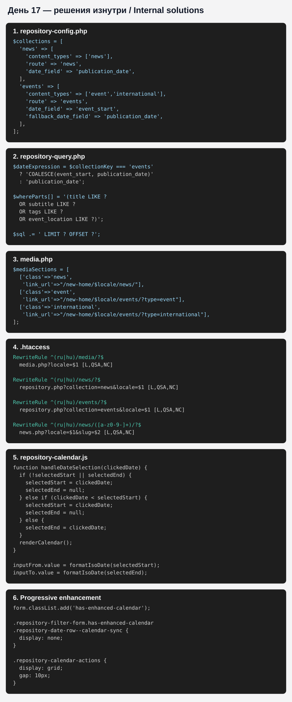

# Day 17A — Visual Appendix and Internal Technical Solutions

**Related report:** `17-Building Publication Repositories, the News and Media Overview, and the Events Calendar.md`  
**Status:** supplementary technical documentation

---

# Why This Appendix Exists

The main Day 17 report records the architecture, implementation process, and verified results. This appendix shows the internal solutions: repository configuration, SQL filtering, routing, calendar logic, and progressive enhancement.

The public documentation intentionally excludes:

- server and database addresses;
- usernames and passwords;
- absolute server paths;
- administrative tokens;
- hosting configuration details;
- personal or corporate information unrelated to the architecture.

---

# Internal Solutions Overview



---

# 1. Repository Configuration

Three editorial content types are served through two public repositories.

```php
$collections = [
    'news' => [
        'enabled' => true,
        'content_types' => ['news'],
        'route' => 'news',
        'date_field' => 'publication_date',
        'sort_mode' => 'newest_first'
    ],

    'events' => [
        'enabled' => true,
        'content_types' => [
            'event',
            'international'
        ],
        'route' => 'events',
        'date_field' => 'event_start',
        'fallback_date_field' =>
            'publication_date',
        'sort_mode' =>
            'upcoming_then_recent',
        'show_type_filter' => true
    ],

    'international' => [
        'enabled' => false,
        'content_types' => [
            'international'
        ]
    ]
];
```

This makes it possible to enable a standalone international-events repository later without migrating records.

---

# 2. Universal Date Expression

News is filtered by publication date, while events use `event_start` with a fallback to `publication_date`.

```php
$dateExpression =
    $collectionKey === 'events'
        ? 'COALESCE(
            event_start,
            publication_date
        )'
        : 'publication_date';
```

---

# 3. Multi-Field Search

```php
$whereParts[] = '(
    title LIKE ?
    OR subtitle LIKE ?
    OR tags LIKE ?
    OR event_location LIKE ?
)';
```

Prepared parameters keep the query safe and allow the search scope to grow without redesigning the page interface.

---

# 4. Pagination

```php
$totalPages = max(
    1,
    (int) ceil(
        $totalItems /
        $itemsPerPage
    )
);

$offset =
    ($currentPage - 1) *
    $itemsPerPage;
```

The main query retrieves only the requested page:

```sql
LIMIT ? OFFSET ?
```

---

# 5. `media.php` Navigation Hub

```php
$mediaSections = [
    [
        'class' => 'news',
        'link_url' =>
            $projectBasePath .
            '/' .
            rawurlencode($locale) .
            '/news/'
    ],

    [
        'class' => 'event',
        'link_url' =>
            $projectBasePath .
            '/' .
            rawurlencode($locale) .
            '/events/?type=event'
    ],

    [
        'class' => 'international',
        'link_url' =>
            $projectBasePath .
            '/' .
            rawurlencode($locale) .
            '/events/?type=international'
    ]
];
```

One overview page acts as a navigation hub for all three semantic sections.

---

# 6. Pretty URLs

```apache
RewriteRule ^(ru|hu)/media/?$ \
    media.php?locale=$1 \
    [L,QSA,NC]

RewriteRule ^(ru|hu)/news/?$ \
    repository.php?collection=news&locale=$1 \
    [L,QSA,NC]

RewriteRule ^(ru|hu)/events/?$ \
    repository.php?collection=events&locale=$1 \
    [L,QSA,NC]

RewriteRule ^(ru|hu)/news/([a-z0-9-]+)/?$ \
    news.php?locale=$1&slug=$2 \
    [L,QSA,NC]
```

Rule order distinguishes the complete `/news/` repository from an individual `/news/<slug>` page.

---

# 7. Calendar Range Selection

```javascript
function handleDateSelection(
    clickedDate
) {
    if (
        !selectedStart ||
        selectedEnd
    ) {
        selectedStart = clickedDate;
        selectedEnd = null;
    } else if (
        compareDates(
            clickedDate,
            selectedStart
        ) < 0
    ) {
        selectedStart = clickedDate;
        selectedEnd = null;
    } else {
        selectedEnd = clickedDate;
    }

    displayMonth =
        firstDayOfMonth(
            selectedStart ||
            clickedDate
        );

    renderCalendar();
}
```

The first click starts a range, the second completes it, and a new click after completion begins a fresh selection.

---

# 8. Synchronization with the Server Form

```javascript
const updateInputs = () => {
    inputFrom.value =
        selectedStart
            ? formatIsoDate(
                selectedStart
            )
            : '';

    inputTo.value =
        selectedEnd
            ? formatIsoDate(
                selectedEnd
            )
            : '';
};
```

JavaScript does not replace server-side filtering. It writes dates into the existing form fields, after which PHP and MySQL process the normal GET request.

---

# 9. Progressive Enhancement

```javascript
form.classList.add(
    'has-enhanced-calendar'
);
```

```css
.repository-filter-form.has-enhanced-calendar
.repository-date-row--calendar-sync {
    display: none;
}
```

```text
JavaScript loads successfully
→ show the enhanced calendar
→ hide the technical date row

JavaScript fails to load
→ keep date_from and date_to available
```

---

# 10. Public User Journey

```text
Homepage
│
├── All News and Media
│   └── /ru/media/
│       ├── /ru/news/
│       ├── /ru/events/?type=event
│       └── /ru/events/?type=international
│
└── All Announcements and Events
    └── /ru/events/
        └── calendar
            └── date_from / date_to
                └── SQL filtering
```

---

# Result

Day 17 connected several architectural layers rather than adding only a visual interface:

```text
configuration
→ prepared SQL
→ routing
→ adaptive cards
→ interactive calendar
→ server-side filtering
```

The code excerpts intentionally exclude confidential infrastructure parameters and are suitable for a public technical portfolio.